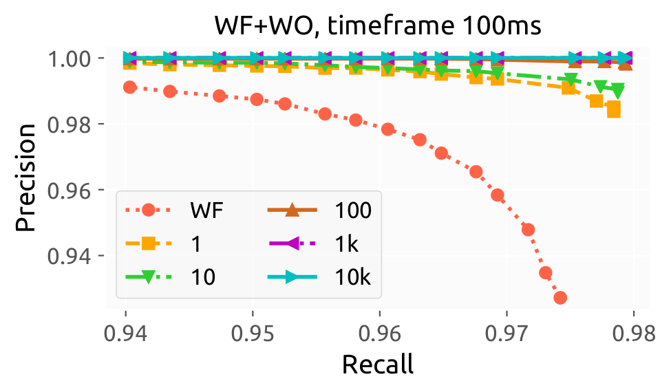

# Simulating Website Fingerprinting with Website Oracles (WF+WO) Attacks

This repository contains scripts and links to datasets to complement the paper
"Website Fingerprinting with Website Oracles", to appear in PETS 2020. The
scripts enable the simulation of WF+WO attacks, given the results (predictions)
from any WF attack. Below you find examples data with detailed instructions as
well as steps to reproduce the key figures in our paper. 

## Setup
To setup, clone this repository, create a [Python 3 virtual
environment](https://docs.python.org/3/tutorial/venv.html) and run `pip install
-r requirements.txt`. All Python scripts and provided data (due to pickle
protocol versions) have been adapted for Python 3, tested on Python 3.7.4. Note
that you may have to run `pip3` instead of `pip`, depending on how Python is
setup on your system. If you don't want to use a virtual environment, it should
be enough to install the `numpy` and `matplotlib` Python packages.

## Run an Example
Download [the example dataset](https://dart.cse.kau.se/wfwo/example.zip) and
unzip it in this directory. Run `example.sh` to simulate WF+WO using the
predictions (pre-computed from the example data) from the [Deep Fingerprinting
(DF) attack by Sirinam et al.](https://github.com/deep-fingerprinting/df) with
no WF defense in place. This will result in:
- The files `example_prob_nodef.pkl` and `example_prob_single.pkl`, that are
  used for calculating metrics (filetype Python Pickled format). 
- Output of typical metrics used for WF attacks in the terminal.
- the file `example_nodef.pdf` that looks something like the figure shown below.

<div align="center">
<p align="center">
  
</p>
</div>

The code, and as shown in `example.sh`, is split into two scripts: `sim.py` for
simulation and `metrics.py` for metrics. For more details on each see below. 

## Details on Simulation
The two example outputs from the simulation--`example_prob_nodef.pkl` and
`example_prob_single.pkl`--are the results of simulating the WF+WO output of two
types of WF attacks based on the _WF_ output:

- Probabilities associated to each possible label (resulting in
  `example_prob_nodef.pkl`), and
- A single label for each test case (resulting in `example_prob_single.pkl`). 

Probabilities are more useful and the defended traces in the example data use
this output. We include one example with single labels as a useful example for
those that might, e.g., want to simulate WF+WO on WF attacks that do not provide
probabilities as output. 

Note above that while we support both types of output from a WF attack, you
don't need to use both. Typically, probabilities are popular now with deep
learning based WF attacks.

The example data also includes predictions by DF for the WF defenses WTF-PAD and
Walkie-Talkie, see the commented out lines in `example.sh` if you also want to
run them.

To run DF attacks (as input to our simulation), we also provide a [simple
version of DF](https://github.com/pylls/df-simple).

### Parameters to the Simulation
The top of `sim.py` shows the arguments:

```
usage: sim.py [-h] -lm LM -lu LU -lp LP -s S [-t T] [-p P] [-a A] [-c C]
                    [-z Z]

optional arguments:
  -h, --help  show this help message and exit
  -lm LM      File with monitored testing labels
  -lu LU      File with unmonitored testing labels
  -lp LP      File with pre-computed predictions from the WF attack
  -s S        Filename for resulting simulated predictions
  -t T        Timeframe in milliseconds
  -p P        Probability of website oracle observing a website visit
  -a A        Max monitored starting Alexa rank 10^{0,a} (inclusive)
  -c C        Scale Tor network size
  -z Z        Be lazy and only re-simulate Tor when it makes sense
              statistically
```

The defaults are a timeframe of `100` ms, `1.0` probability, max Alexa rank `4`
(so Alexa rank 10,000), and being lazy when simulating. 

### Using Predictions From Other WF Attacks
To use this script to simulate WF+WO attacks based on the output of another WF
attack, please see the instructions in the `main()` function of `sim.py`. In a
gist, you need to write a load function that structures the output of your WF
attack (that is provided as input to `sim.py`) in one of the expected formats.
Once that is done, the output of `sim.py` is largely what `metrics.py` expects.

## Details on Metrics
The `metrics.py` script has the following parameters:

```
usage: metrics.py [-h] -lm LM -lu LU -p P [-wf WF] [-d D] [-o O]

optional arguments:
  -h, --help  show this help message and exit
  -lm LM      File with monitored testing labels
  -lu LU      File with unmonitored testing labels
  -p P        File with simulated predictions from sim_wf+wo.py
  -wf WF      File with WF predictions provided as input to sim_wf+wo.py (for
              comparison)
  -d D        The figure title that describes the experiment
  -o O        Filename for the figure output
```
The script prints basic ML metrics used by the WF community. In addition, for
simulated WF+WO attacks that provide probabilities for each label, the script
also uses a threshold value and provides as output a precision-recall figure.

In both cases, if the `-wf` flag is provided with a path to the WF predictions
provided as input to `sim.py`, the script will also print metrics and include
the WF attack in the figure (if applicable). Note that you also need to replace
the `load_wf_predictions()` function here as in `sim.py`. 

## Reproducing Important Figures
Download the [predictions
dataset](https://dart.cse.kau.se/wfwo/reproduce-data.zip), unzip in this
directory, and run `reproduce.sh`. This should generate the nine sub-figures
that make up Figures 6-8 in the paper.

Note that Figures 6-8 from the paper are based on using [simple
DF](https://github.com/pylls/df-simple) to train and classify on three different
datasets, resulting in a number of predictions from the DF attack. This step is
_not_ part of reproducing our key WF+WO figures above: it takes around ten hours
(wall time) to train DF on these large datasets with a GPU. Rather, we provide
the resulting predictions from DF that we based our results on instead in the
link above. If you want to reproduce the DF part, please reach out to the
corresponding author of the paper.
